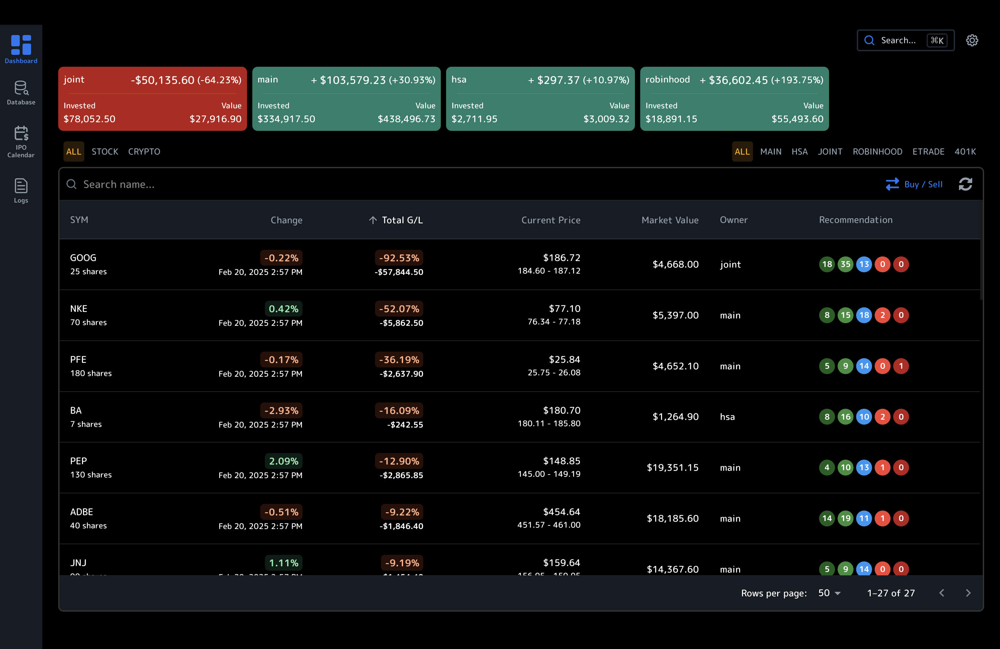
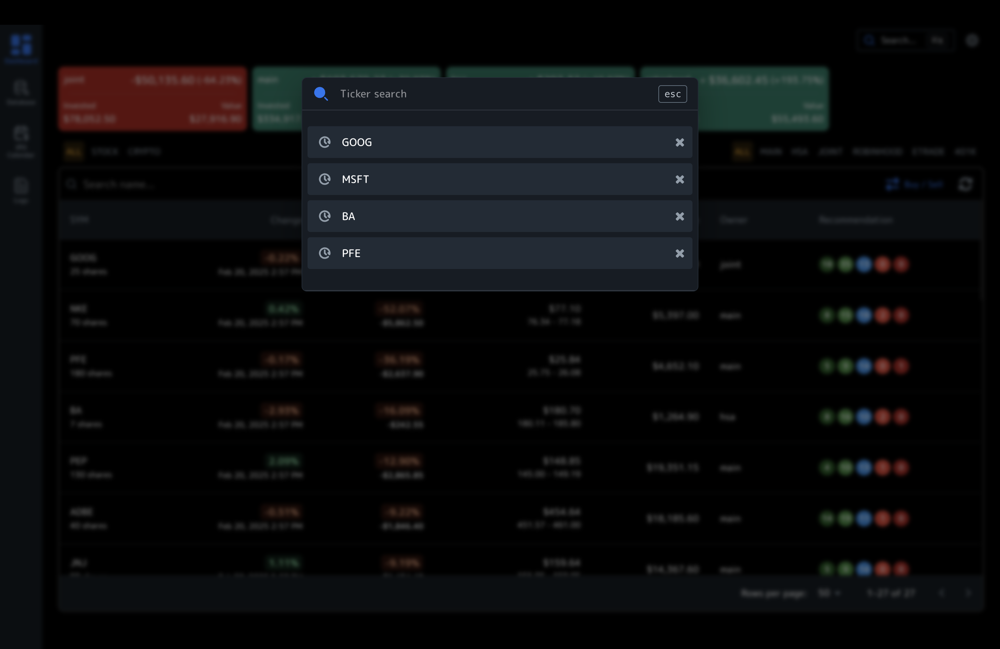
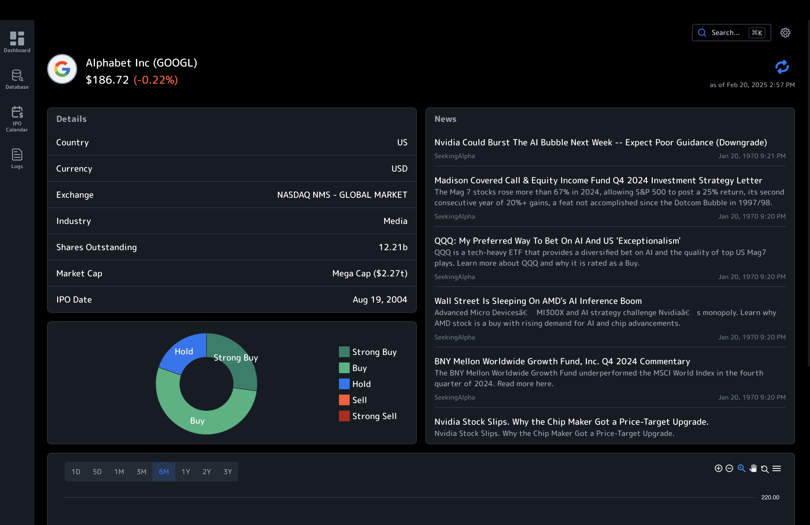
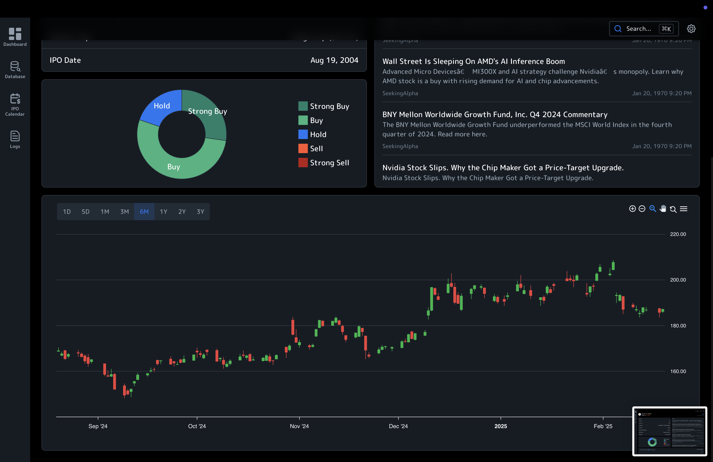
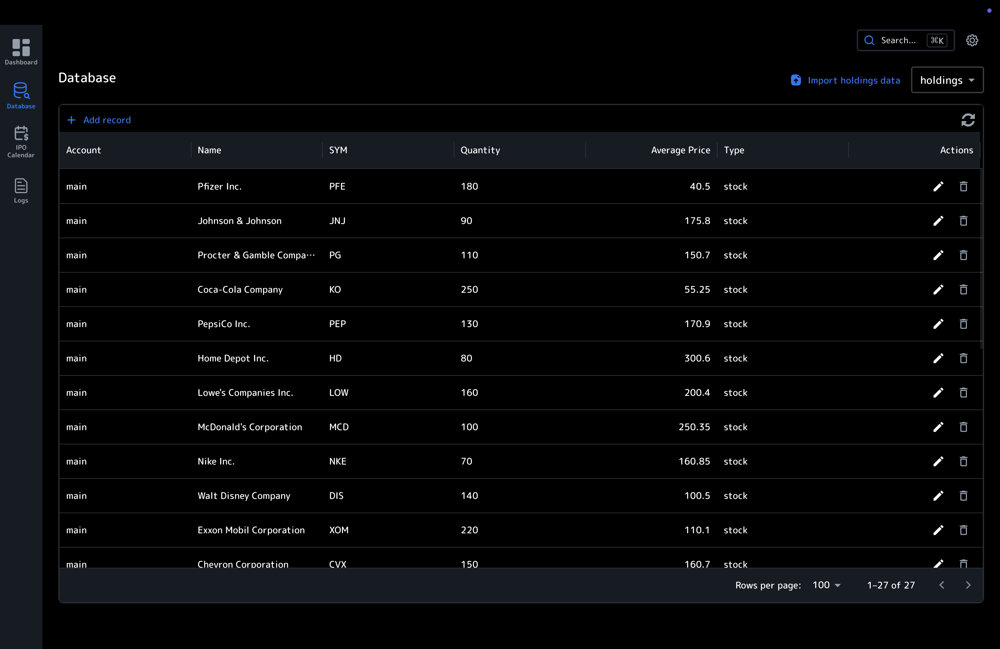
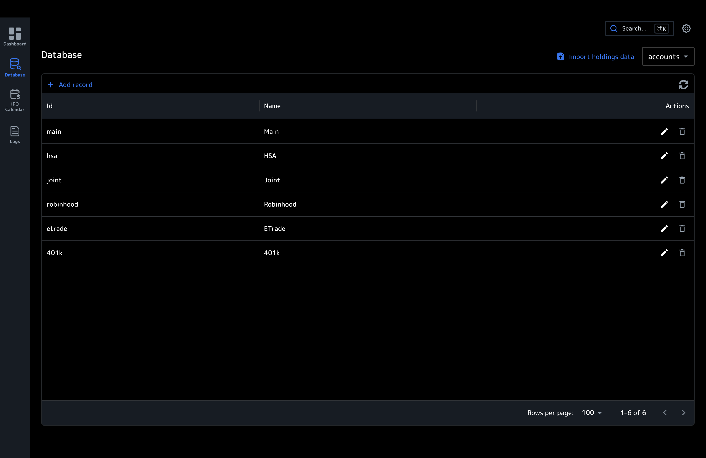
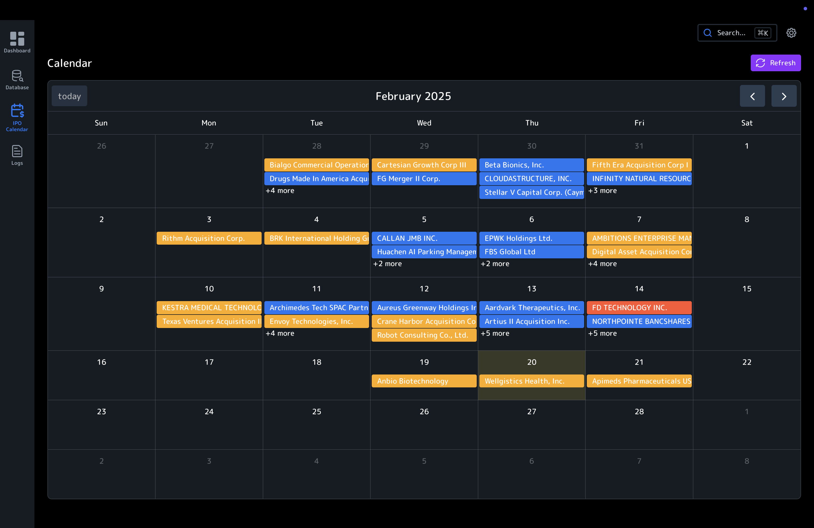

# Portfolio Dashboard

This project is for people who have multiple investment / crypto / retirement accounts and want to track all of them under a single dashboard without handing over your data. It has basic functionality like upcoming IPO dates, basic market research and analyst recommendations.

      

## Features

- Track your stock portfolio
- View your holdings and their performance
- View your transactions
- View market news and recommendations
- View IPOs

## Setup
1. Clone, install and run the backend for this application [portfioli-dashboard-db](https://github.com/rajatb-git/portfolio-dashboard-db)
2. Install this repo using pnpm and run

## Contributing

Contributions are welcome! Please open an issue or submit a pull request.

## License

MIT