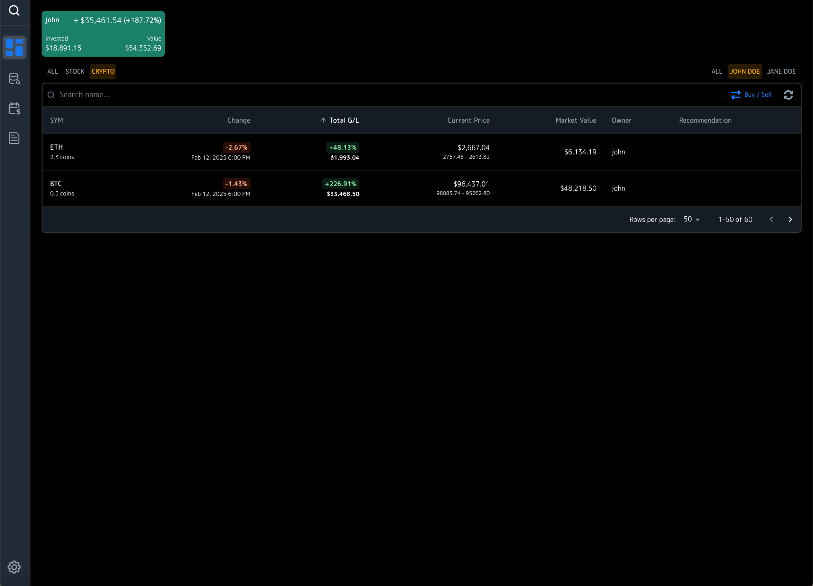
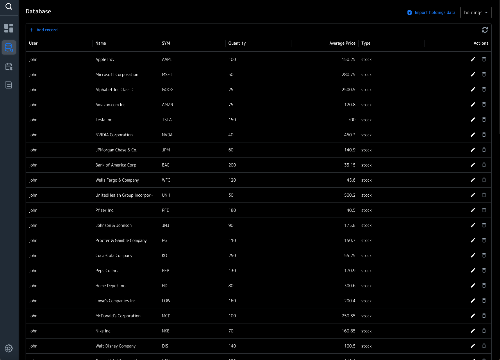
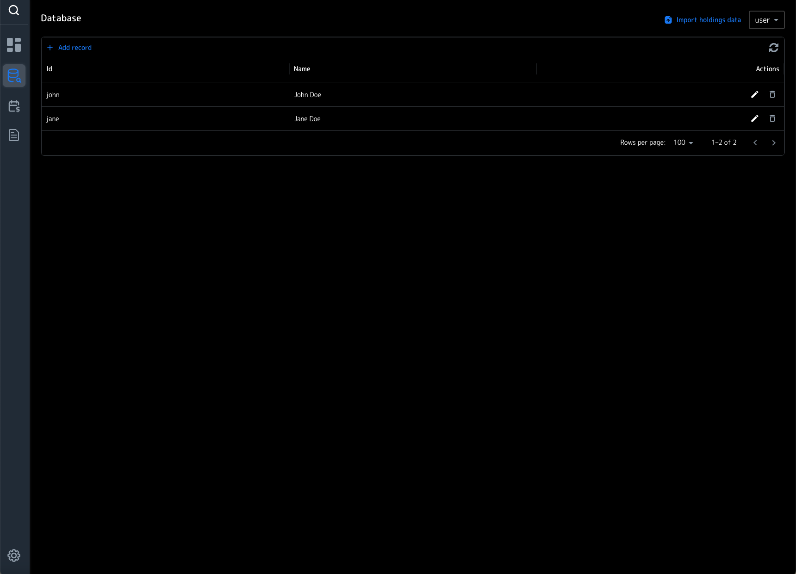
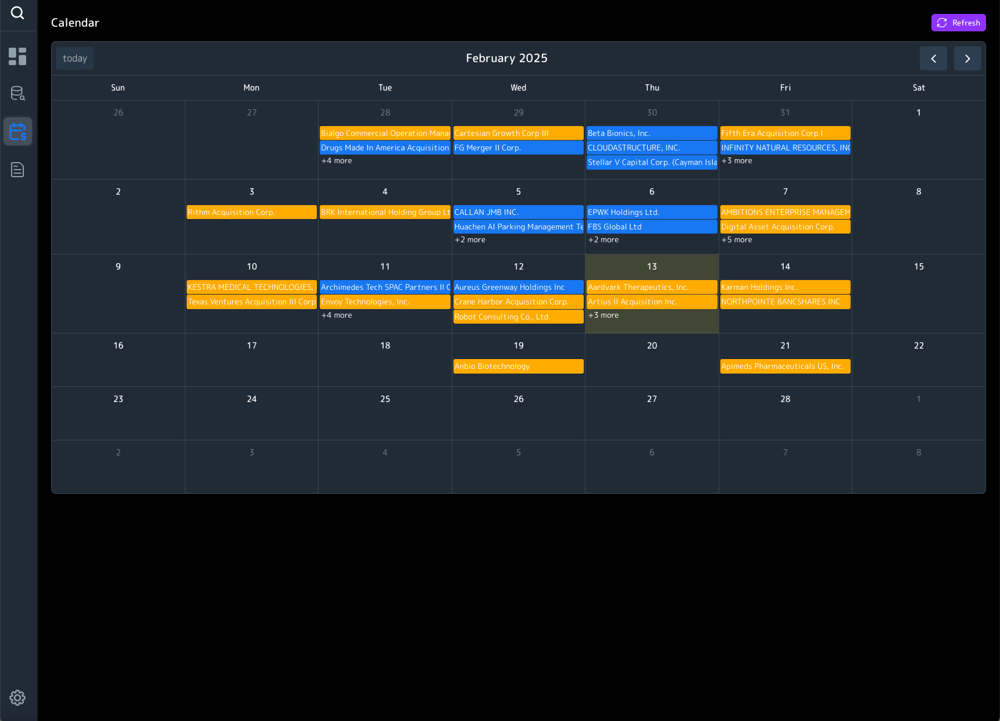
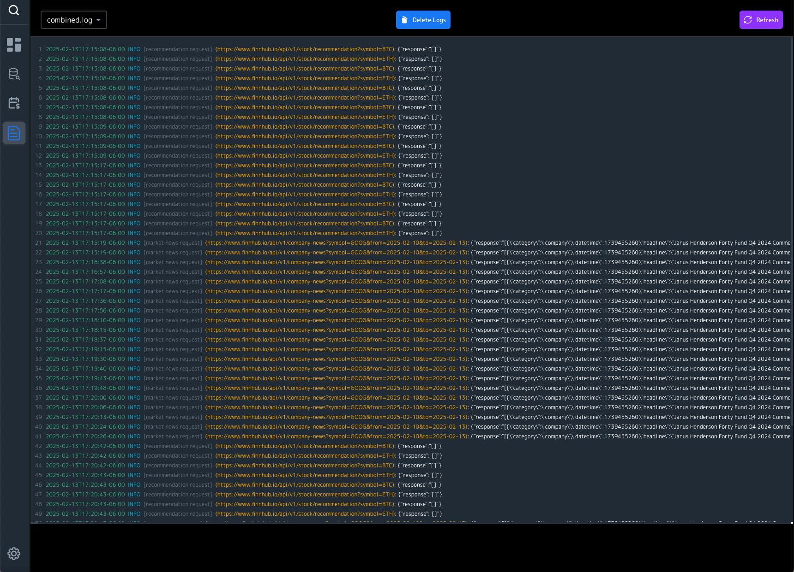

# Portfolio Dashboard

A dashboard to manage and track your stock movements!

     

## Features

- Track your stock portfolio
- View your holdings and their performance
- View your transactions
- View market news and recommendations
- View IPOs

## Installation

1. Clone the repository
2. Install dependencies: `npm install`
3. Start the development server: `npm run dev`

## Usage

1. Open the dashboard in your browser
2. Add your holdings
3. Track your portfolio

## Contributing

Contributions are welcome! Please open an issue or submit a pull request.

## License

MIT